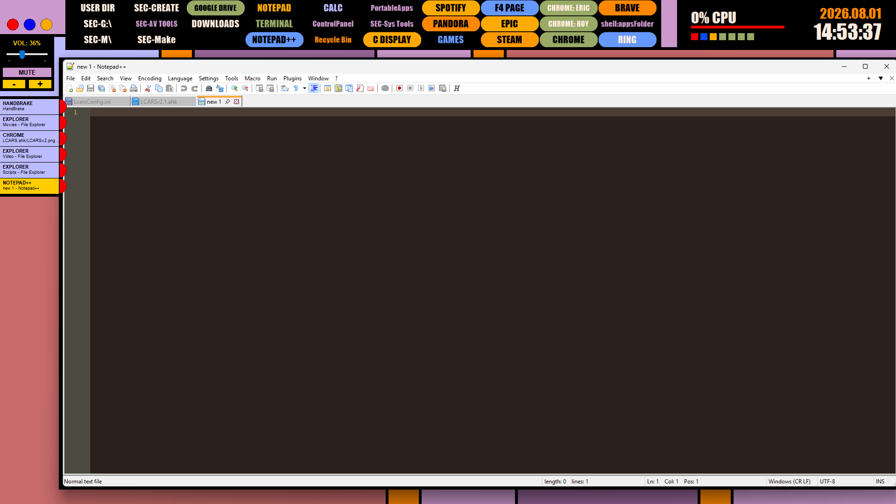

# LCARS.ahk Terminal Interface Engine (v2.1)

A fully responsive, modular Star Trek LCARS terminal interface and desktop environment manager for Windows built from the ground up using **AutoHotkey v2**.

Designed as a multi-layered, non-activating GUI stack (`WS_EX_NOACTIVATE`), this engine acts as a custom desktop skin and workstation launcher without stealing keyboard focus or interfering with Windows auto-hide taskbars.

---

## ✨ Key Features

* **Split-Layer GUI Architecture:** Click-through background frame canvas (`+E0x20`) paired with interactive foreground overlay modules.
* **Dynamic Taskbar Dock & Sidebar:** Real-time window process tracking and re-indexing using Windows Shell Hooks with isolated chroma-keying (`COLOR_DOCK_BG`).
* **Dynamic GDI+ Vector Launcher Grid:** 32-bit anti-aliased pill controls supporting dynamic font auto-scaling, multi-tier color state cycling, and drag-and-drop tile management.
* **GDI+ Vector System Controls:** Crisp, scaled vector UI controls for system termination, viewport snapping, and desktop matrix realignment.
* **System Telemetry Monitoring:** Live WMI performance tracking for CPU, RAM, Network throughput, and Drive space usage.
* **Non-Intrusive Volume & Clock Widgets:** Direct AHK v2 native hardware hooks for audio control and dynamic date/time format toggling.
* **Smart Viewport Snapper:** Automatic active-window caching (`~LButton` hooks) to snap application windows clean into the central LCARS viewing viewport.

---

## 🖥️ Recommended System Setup

This engine dynamically calculates screen coordinates and scales interface components across different monitor resolutions automatically. To get the full, authentic LCARS terminal experience, the following Windows display settings are recommended:

### 1. Auto-Hide the Windows Taskbar
Because LCARS features its own dynamic sidebar dock to track active applications, hiding the native Windows taskbar creates an immersive, edge-to-edge terminal environment:
* Right-click the Windows Taskbar ➔ **Taskbar settings**
* Expand **Taskbar behaviors**
* Check **Automatically hide the taskbar**

### 2. Set Background to Solid Black
To seamlessly blend the click-through canvas framing with your desktop:
* Go to **Settings ➔ Personalization ➔ Background**
* Change the background type to **Solid color**
* Select **Pure Black (`#000000`)**

### 3. Display Resolution & Scaling
* Built and tested on standard 16:9 display ratios (1080p, 1440p, 4K).
* All UI modules use dynamic ratio multipliers based on monitor height to scale block heights, font sizes, and telemetry reservations automatically.

---

## 🚀 Getting Started & Installation

### Option 1: Standalone Executable (Recommended)
No coding or AutoHotkey installation is required to run the standalone build.

1. Navigate to the **Releases** section of this repository.
2. Download the latest `LCARSv2.exe` and `LcarsConfig.ini` files.
3. Place both files into the same folder on your system.
4. Double-click `LCARSv2.exe` to launch the terminal interface.

---

### Option 2: Running from Source Code (For Customization & Scripting)

#### Prerequisites
* **Windows OS** (10 or 11)
* **AutoHotkey v2.0+** installed on your system

#### Setup Steps
1. Clone this repository or download the source ZIP:
   git clone https://github.com/ericfmyers/LCARS.ahk.git
2. Ensure `LCARSv2.ahk` and `LcarsConfig.ini` are located in the same directory.
3. Double-click `LCARSv2.ahk` to execute the interface script.

---

## 🕹️ Instructions for Use

### 1. Interactive Vector System Controls (Top-Left Three-Dot Menu)
* **Target Application:** Click inside any open application window on your screen to focus it.
* **Snap Viewport (Blue Dot):** Click the **Blue Vector Dot** to automatically restore and snap the active window perfectly into the central LCARS viewing viewport.
* **Master Exit (Red Dot):** Click the **Red Vector Dot** to terminate and close the LCARS system engine immediately.
* **Realign Desktop Icons (Gold Dot):** Click the **Gold Vector Dot** to shift all desktop icons over into the visible viewport area so they aren't hidden behind the side panels. *(Note: Use with caution, as this will automatically rearrange your current desktop icon layout!)*

### 2. Application Shortcut Grid (Top Menu)
* **Add a New Shortcut:** Click any empty tile in the top grid. Enter a display label and target file path, folder, or URL when prompted. *(Note: Do not include quotation marks or parentheses around the target path).*
* **Launch an Application:** Click an active shortcut tile to open the application in maximized mode.
* **3-Tier Color & Text Cycling (`Alt + Right-Click`):** Press `Alt` while right-clicking an occupied tile to cycle through 3 distinct color combinations:
  * **Tier 1:** Standard LCARS Accent Button + Dark Text
  * **Tier 2:** Standard LCARS Accent Button + Cream Text
  * **Tier 3:** Solid Black Button + Accent/Cream Text
* **Move / Rearrange:** Click and drag a shortcut tile over an empty slot to relocate it.
* **Delete a Shortcut (`Ctrl + Right-Click`):** Press `Ctrl` while right-clicking an occupied tile to permanently delete it (requires confirmation prompt).

### 3. Dynamic Taskbar & Sidebar Dock
* Tracks running applications and open windows automatically in real-time.
* Click an application tile in the sidebar to bring that window to the front.
* Click the red tactical close symbol on a dock block to terminate that application.
* **Slot Color Indicators:** 
  * **Yellow Tile:** Represents the currently **active** window (Operations Yellow).
  * **Light Blue Tile:** Represents an **inactive** background window.

### 4. Telemetry & Widgets
* **System Stats:** Click the small indicator squares next to the telemetry readout to toggle real-time performance tracking:
  * **Red Square:** CPU load percentage.
  * **Blue Square:** RAM usage percentage.
  * **Gold Square:** Network bandwidth throughput.
  * **Green Square(s):** Drive storage utilization (individual blocks represent available system drives).
* **Clock Widget:** Click the Date text to toggle date formats (`YYYY.MM.DD` vs `MM.DD.YYYY`); click the Time text to toggle 24-hour vs 12-hour time formats.
* **Volume Widget:** Use the native slider, `+` / `-` buttons, or `MUTE` toggle to adjust system audio without taking window focus away from active applications.

---

## 📄 License

This project is licensed under the MIT License — see below for details:

MIT License

Copyright (c) 2026 Eric Myers

Permission is hereby granted, free of charge, to any person obtaining a copy
of this software and associated documentation files (the "Software"), to deal
in the Software without restriction, including without limitation the rights
to use, copy, modify, merge, publish, distribute, sublicense, and/or sell
copies of the Software, and to permit persons to whom the Software is
furnished to do so, subject to the following conditions:

The above copyright notice and this permission notice shall be included in all
copies or substantial portions of the Software.

THE SOFTWARE IS PROVIDED "AS IS", WITHOUT WARRANTY OF ANY KIND, EXPRESS OR
IMPLIED, INCLUDING BUT NOT LIMITED TO THE WARRANTIES OF MERCHANTABILITY,
FITNESS FOR A PARTICULAR PURPOSE AND NONINFRINGEMENT. IN NO EVENT SHALL THE
AUTHORS OR COPYRIGHT HOLDERS BE LIABLE FOR ANY CLAIM, DAMAGES OR OTHER
LIABILITY, WHETHER IN ACTION OF CONTRACT, TORT OR OTHERWISE, ARISING FROM,
OUT OF OR IN CONNECTION WITH THE SOFTWARE OR THE USE OR OTHER DEALINGS IN THE
SOFTWARE.
