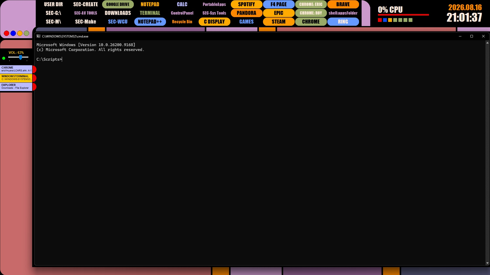

# LCARS.ahk Terminal Interface Engine (v2.2)



A fully responsive, modular Star Trek LCARS terminal interface and desktop environment manager for Windows built from the ground up using AutoHotkey v2.

Designed as a multi-layered, non-activating GUI stack (`WS_EX_NOACTIVATE`), this engine acts as a custom desktop skin and workstation launcher without stealing keyboard focus or interfering with Windows auto-hide taskbars.

---

## ✨ Key Features

* **Split-Layer GUI Architecture:** Click-through background frame canvas (`+E0x20`) paired with interactive foreground overlay modules.
* **Dynamic Taskbar Dock & Sidebar:** Real-time window process tracking and re-indexing using Windows Shell Hooks with isolated chroma-keying (`COLOR_DOCK_BG`) and 1px interstitial dividers.
* **Dynamic GDI+ Vector Launcher Grid:** 32-bit anti-aliased pill controls supporting dynamic font auto-scaling, multi-tier color state cycling, and drag-and-drop tile management.
* **Quad-Vector System Controls:** Crisp, scaled vector GDI+ UI controls for system termination, viewport snapping, desktop matrix realignment, and primary repository navigation.
* **System Telemetry Monitoring:** Live WMI performance tracking for CPU, RAM, Network throughput, and Drive space usage with an asynchronous 3000ms performance throttle.
* **Non-Intrusive Volume & Clock Widgets:** Direct AHK v2 native hardware hooks for audio control with a dynamic GDI+ mute status dot and time/date format toggling.
* **Smart Viewport Snapper:** Automatic active-window caching (`~LButton` hooks) to snap application windows clean into the central LCARS viewing viewport.

---

## 🖥️ Recommended System Setup

This engine dynamically calculates screen coordinates and scales interface components across different monitor resolutions automatically. To get the full, authentic LCARS terminal experience, the following Windows display settings are recommended:

### 1. Auto-Hide the Windows Taskbar
Because LCARS features its own dynamic sidebar dock to track active applications, hiding the native Windows taskbar creates an immersive, edge-to-edge terminal environment:
1. Right-click the Windows Taskbar ➔ **Taskbar settings**
2. Expand **Taskbar behaviors**
3. Check **Automatically hide the taskbar**

### 2. Set Background to Solid Black
To seamlessly blend the click-through canvas framing with your desktop:
1. Go to **Settings ➔ Personalization ➔ Background**
2. Change the background type to **Solid color**
3. Select **Pure Black (#000000)**

### 3. Display Resolution & Scaling
* Built and tested on standard 16:9 display ratios (1080p, 1440p, 4K).
* All UI modules use dynamic ratio multipliers based on monitor height to scale block heights, font sizes, and telemetry reservations automatically.

---

## 🚀 Getting Started & Installation

### Option 1: Standalone Executable (Recommended)
No coding or AutoHotkey installation is required to run the standalone build:
1. Navigate to the **Releases** section of this repository.
2. Download the latest `LCARSv2.exe` and `LcarsConfig.ini` files.
3. Place both files into the same folder on your system.
4. Double-click `LCARSv2.exe` to launch the terminal interface.

### Option 2: Running from Source Code (For Customization & Scripting)

#### Prerequisites
* Windows OS (10 or 11)
* AutoHotkey v2.0+ installed on your system

#### Setup Steps
1. Clone this repository or download the source ZIP:
   ```bash
   git clone [https://github.com/ericfmyers/LCARS.ahk.git](https://github.com/ericfmyers/LCARS.ahk.git)
